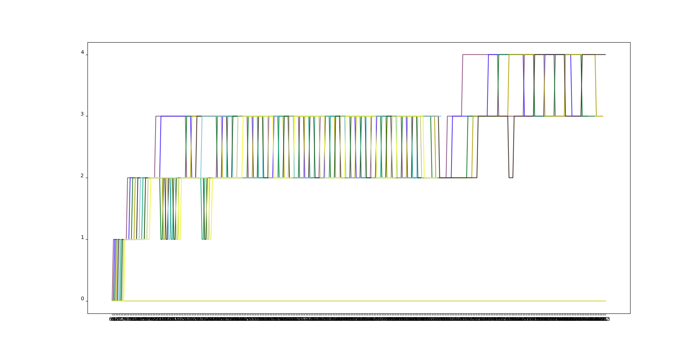

# Extending xv6

## 1.1: `strace`

All procs have a trace mask which is a bitvector of all the syscalls that should be traced for it.
When we call a syscall from `syscall()`, we check the bitvector, and print it if the bit is true.

Children also inherit the trace mask from the parent in `fork()`.

We have an `strace` user program which sets the trace mask for it using the systemcall and then execs
whatever program we need. SO we can trace any executable.

## 1.2 `sigalarm` and `sigreturn`

On `sigalarm` we set save the handler and interval in the proc struct. and then, on every timer interrupt, 
we check if the interval amount of ticks have passed and if it has, we set the pc to the handler for the process.
We also save the trapframe so that we can return to that trapframe using `sigreturn`

## 2.a `FCFS`

We save the ticks passed at the process creation time on the proc struct and then in the scheduler, loop through
all the processes and context switches to the one with the least creation time.

## 2.b `Lottery Based Scheduler`

We add a new systemcall `settickets` that allow each process to set `tickets` for itself -- which is default 60.
Then, we basically generate a random number till the total amount of tickets, and runs the process with the ticket
 -- ie, golden ticket = random number, start from beginning of proc table, keep on adding the tickets foreach process
 and when we reach the golden ticket, run that process.

## 2.c `PBS`

We have a niceness value, which is the ratio of time a process spends cpu time to sleeping. We also have a static priority that we
can set using a `set_priority` syscall. A dynamic priority is calculated from niceness and static priority. Dynamic priority and niceness 
are calculated on the spot.

If the calculated priority is same for two processes, we tie break using hte number of times the process has run. We save that in a `nrun` variable
in the proc struct. If the tie still exists, we tie break using the process creation time.

## 2.d `MLFQ`

MLFQ has 5 queues. The process enters the first queue -- the highest priority queue first. but has limited time quanta available. After that, it will be 
moved to a higher queue. Where the time quanta is increased. 

MLFQ will always run the highest priority process. Even when running a lower priority process, if a higher priority process starts, MLFQ will preempt it
and run the higher priority project. We keep track of the time the process waits in queue also and if it goes above a specified limit -- 20 ticks at the moment
(defined in `defs.h` as `MAXAGE`), the process will be moved down a priority queue.

Processes which are sleeping are removed from the queue and are added back in when the require CPU -- processes can abuse this my running for a little below
their their time quanta, then sleeping, and then start again, as the time quanta assigned to it is reset, it can always stay in the same queue.

## 3 COW Fork

We keep track of all references to a page from all pagetables in a static array. On `kfree`, we decrease the reference and only really mark the page free
if it's number of references become zero. We use the normal kmem spinlock to make sure that the reference changes are atomic.

When a process is forked, we just map the same page to the child pagetable also. We use the 8th bit of the PTE -- one of the RSW bits, to
mark that PTE as a COW page. We also set the PTE as read only by removing the write bit.

Then, when a process tries to write to that PTE, a pagefault will be generated. We check if it's a COW page and copy that page at that time.
The new page will be writable. We decrement the reference to that page also.

When the reference is just 1, we dont copy and just set the PTE as writable.

## Analysis of MLFQ

As we can see in the  The initial high priority queues
are always run first but their time quanta runs out fast. We can also wee some processes aging and going to high priority again.

We can also see some processes staying in high priority -- they are the sleeping processes. processes can abuse this my running for a little below
their their time quanta, then sleeping, and then start again, as the time quanta assigned to it is reset, it can always stay in the same queue.
